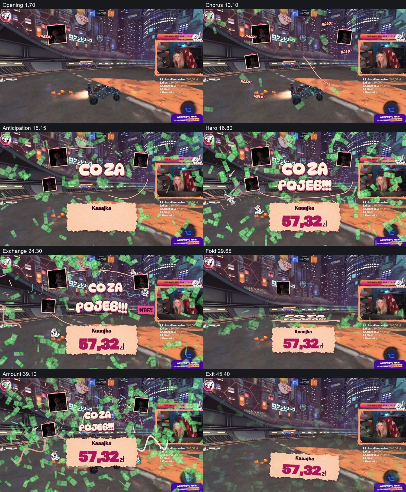
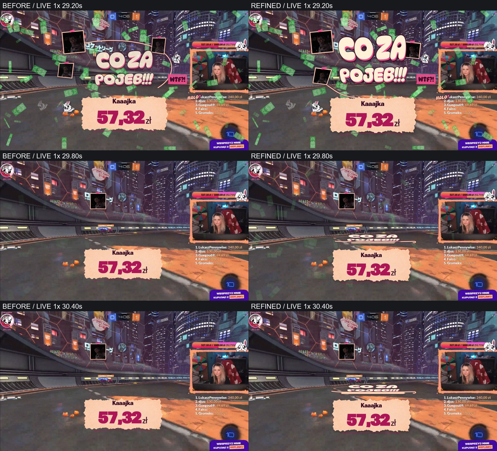
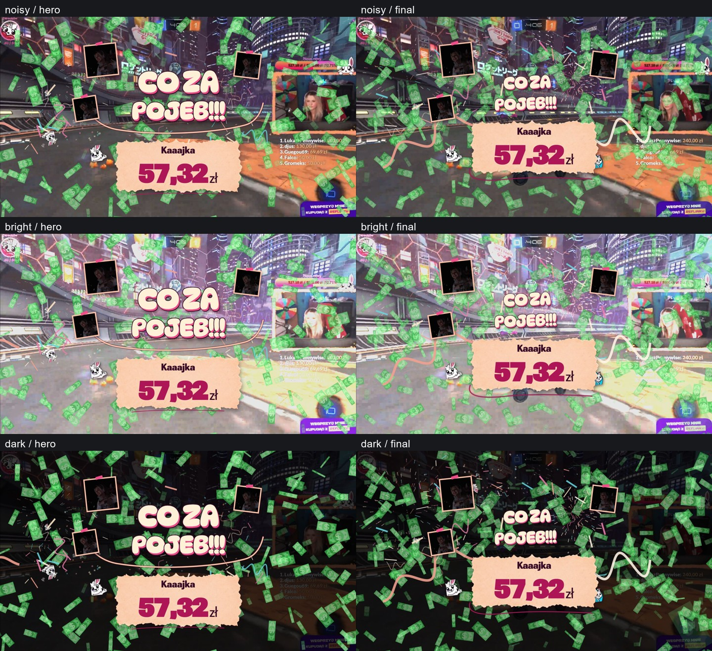

# Donate7 definitive — final delivery report

This pass continues the preserved Version A working tree on `michal-szwindowski/donation-motion-engine`. The selected reaction-scrapbook direction is implemented with centered primary typography/data, the original green money asset, original webcam footage and community emotes. POJEB is authored at15.49932s; the37.65116s finale hands visual priority to the amount. GSAP remains the only choreography authority.

Engineering verification and rendered visual review are distinct from human musical acceptance. This environment does not provide a reliable perceptual listening feed; no completed human1× watch/listen, ten listening passes, exact lyric alignment or professional After Effects-level subjective acceptance is claimed. The complete recording carries the actual music and TTS output for that review.

## A. Git safety and scope

Version A was secured and pushed as `842f6ac` (implementation) and `2f372da` (documentation/evidence), baseline full SHA `2f372da3b5f8a1cadab5cacc14f2d3d42550728b`. No reset, revert, checkout, discard or main merge was used. This continuation began with18 modified tracked files plus new evidence/docs/assets, so the earlier22-file description was a historical count, not evidence of missing work. The implementation remains Donate7-scoped. Shared engine changes are guarded for tier7; other tiers' timestamps and treatment logic remain intact. No infrastructure, public Studio, cloud backend or next-tier creative work was added.

The latest owner instruction supersedes the earlier immediate commit/push request: present the final visual evidence before finalizing the branch. Current implementation remains uncommitted for that review. The baseline local/remote SHA, current status and fresh validation are recorded in [final review](DONATE7_FINAL_REVIEW.md); no clean working-tree or new push is claimed.

## B–D. Legacy, Version A and research

[Direction/research record](DONATE7_DEFINITIVE_DIRECTION.md) documents actual legacy behavior: one webcam,150 money elements,30 HALO elements, CO/ZA/POJEB at13.3/13.9/14.5s. The monitor wall and fireworks were Version A interpretations. Original expressive source and absurd public interruption survive; continuous flashing and indefinite uniform rain do not.

Version A's deterministic clock, bounded lifecycle and original source are retained. Its left-led headline/right monitor-wall composition and repeated title attacks are replaced by a centered statement, small reaction apertures, caller chorus, curved eye flow and amount-led conclusion. BUCK/Nexus principles and official GSAP references are linked in the direction record. Applied techniques: paused absolute-time score, SplitText glyphs, CustomEase weighting, DrawSVG accents and MotionPath phrase arcs. No second clock or engine.

## E–F. Music Gold and complete motion score

[Music Gold](DONATE7_MUSIC_GOLD.md) contains identity evidence, source hash/duration46.233968s, four-stem measurements, spectral/dynamic interpretation and the complete timestamped score. Tags/catalog evidence support Hislerim / Serhat Durmus; exact local cut/remix/master remains unconfirmed. Candidate129.199BPM/4/4 and pitch/chroma data are estimates, not manually approved beat phase or harmony. No unverified ASR words drive semantic events. The stronger joint drums15.49932/bass15.51093 entry motivates the new payoff; CO/ZA prepare it. Final joint transient37.65116 motivates the amount takeover.

## G. Art direction, assets and dependencies

DynaPuff5.3.0 supplies the inflated rounded statement; Roboto Flex5.3.0 provides clear flexible donor digits and Polish glyphs. Both are self-hosted OFL variable fonts. Poppins Information/TTS styling remains. The peach paper is generated transparent raster material; all webcam/emote identities remain original. [Asset manifest](assets/donate7-definitive/asset-manifest.json) and font licenses preserve provenance.

Money is the unchanged project `src/assets/images/effects/banknote-particle.png`,56×56 with transparent margins, uploaded as an owned Pixi texture without recoloring. [Runtime/source byte verification](assets/donate7-showpiece/round-final/backgrounds-and-money.json) records SHA256 `ccad9825cb4c459f23c8643c369b310a4350dde9838429b462e23f488ab589d9`. BACK/MID/FRONT use28–48/55–93/145–225logicalpx sizes. No placeholder fallback or banknote side-lane/repulsion remains. Typography is protected through depth, opacity, sparse foreground and score envelopes.

[Motion toolbox](MOTION_TOOLBOX_PIXI.md) is the current dependency/renderer decision. PixiJS8.22.0, pixi-filters6.1.5 and Three0.186.1 were explicitly authorized and installed. Pixi renders money; Three/curated filters remain provisioned without being loaded into Donate7. The earlier [evaluation](DONATE7_RENDERING_EVALUATION.md) records a superseded Canvas-first decision, not the current recommendation.

## H–I. Chapters and before/after

Current evidence is **assets/donate7-showpiece/round-final**. The centered Canvas-money pass is retained as historical evidence; the user rejected that money motion and explicitly required this Pixi replacement. Earlier `pre-animation`, `round-1`, `round-2`, `round-review-*` folders are explicitly historical iterations; they are not final output.

The current [transition comparison](assets/donate7-showpiece/transitions-before-after.mp4) uses identical encoded timestamps from independent normal-speed captures, with refined audio only. These labels are video time, not a claim of sub-frame audio cue equivalence. Historical [legacy recording](assets/donate7-definitive/legacy-original-reconstructed.mp4) and [Version A recording](assets/donate7-creative/donate7-full-realtime-audio.mp4) remain available.

## J. Complete normal-speed evidence

[Final complete recording](assets/donate7-showpiece/donate7-full-realtime-audio.mp4) and [capture metadata](assets/donate7-showpiece/realtime-recording.json) use live CDP frame timestamps plus an actual WebAudio output tap. Audio is not replaced with an offline soundtrack. The full nickname→amount→message TTS→outro lifecycle is retained. Encoded30fps is a delivery format; it does not claim every live frame was rendered at30 or60fps.

The capture metadata records measured frames, phase sequence, audio offset and errors. The accompanying delivery record contains the frozen-source totals; it does not claim human listening or60fps capture.

## K–L. Responsive, content and gameplay stress

Four formats:1920×1080(16:9),1920×1200(16:10),3440×1440(21:9),5120×1440(32:9). Primary paper/title rest axes remain viewport-center; active poses retain designed local motion. The original footage stays small rather than being upscaled to fill a monitor wall.

Eight amount inputs cover5zł through9,999,999,999.99zł (the maximum valid parsed value), including57.32,999.99,2,137.69,15,000,99,999.99 and1,000,000. The32-character W name stays complete over two lines; Kaaajka provides the short-name case. Name/amount separation is checked across all four formats and after backward seeks. Top padding is at least68px and additionally accounts for the measured loaded name/amount blocks and the paper alpha-edge fraction; side/bottom padding36/30 and24px gap preserve the full wrapped name and final digit lift. The torn alpha casts a restrained soft shadow. Secondary ribbons sit below semantic paper.

Noisy is the original Rocket League reference. Bright and dark are declared exposure simulations of the same image, not three separate recorded games. Outlined hero text and opaque peach paper keep primary reading areas distinct. HIGH/MEDIUM/SAFE screenshots retain the same hierarchy while density changes.

## M. Performance and limits

Final frozen-source measurements are recorded in [live audio-clock performance](assets/donate7-showpiece/performance.json) and [fixed-quality export sampling](assets/donate7-showpiece/performance-fixed.json). The host uses ANGLE/Vulkan SwiftShader software rendering, DPR1; these are not RTX3070/OBS hardware benchmarks. Pixi submission time excludes GPU/compositor work; heap excludes native/GPU memory. Requested live quality may adapt and actual quality is recorded. Fixed-quality seek sampling is a separate workload with source frame seeking and no playing audio.

Money caps are540/310/135, backing targets2.1M/1.5M/0.9Mpixels. Separate confetti/ribbon/spark Canvas caps remain480/260/110 across their own three surfaces; these counts must not be conflated with money. SAFE preserves full-stage rain and original identity. No60fps target-OBS claim is made.

## N. Tests and exact-frame/export checks

The final validation record and export proof live in [Motion toolbox delivery](MOTION_TOOLBOX_PIXI.md). Checks include typecheck,36 unit-test files,88 browser tests, build and lint; deterministic forward/backward/restart poses; transparent alpha at exact0; clean Information; four formats/eight amounts; delayed WOFF2 font loads; original money; actual full TTS lifecycle; and CLI rendered selection with encoded stream metadata.

The browser determinism check asserts exact transforms/opacity/visibility/font axes/geometry. Native SwiftShader raster edges may vary within a documented0.2% pixel bound at24/255 channel tolerance; bit-identical raster exports across platforms are not promised. Particle draw-command reconstruction is independently exact in unit tests.

Two inherited failures and their corrections are detailed in [motion refinement](DONATE7_MOTION_REFINEMENT.md): obsolete13.21215s hero assertion and the interrupted full-lifecycle run during font/HMR replacement. A new delayed-font test initially called a nonexistent debug `restart` method; its test harness now uses the actual seek0→play→pause API and passed separately. It was a test error, not a missing product feature.

## Remaining acceptance limits

Human normal-speed listening/creative acceptance, exact local master identity, reliable semantic lyric alignment and real target OBS/gameplay performance remain unverified. Original120px reaction footage deliberately remains low resolution. Build's existing main-bundle size warning and lint's44 warnings/38 infos remain documented. No unrelated infrastructure or generic cleanup was folded into this creative pass.
