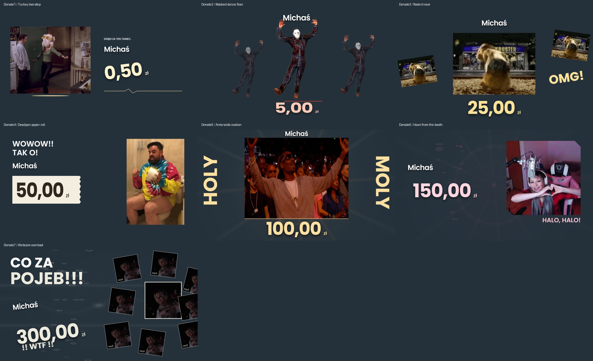

# GIF-led donation art direction

Design contract: source-led miniature music videos, seed `d2f60c0f`. User-selected GIFs and existing music override the discarded common aperture system. All seven originals are unchanged. Source contact sheets inspect beginning,15%,30%,45%,60%,75% and final frame; characteristic source poses are authored separately.

The following contact sheet is retained production-v2 history; current v2.2 source-native placements and zero/Information contracts are in PRODUCTION_22_DIRECTION.md and DESIGN.md.

| Tier | Source | Dimensions / frames / loop | Concept |
|---|---|---|---|
|1|`donation-template-01.gif`|480x400 / 38 / 2.54s infinite|Turkey two-step: A turkey-foot two-step answered by an independently tilting amount on the right.|
|2|`donation-template-02.gif`|343x480 / 142 / 5.68s infinite|Masked dance floor: A three-position transparent dance echo with arms-up freeze on the hit.|
|3|`donation-template-03.gif`|320x240 / 10 / 0.44s infinite|Rodent rave: Ten-frame film-strip stutter with hard shutter cuts and phase-offset screens.|
|4|`donation-template-04.gif`|322x480 / 97 / 6.47s infinite|Deadpan paper roll: A horizontal paper-roll amount reveal paired with a planted bathroom portrait.|
|5|`donation-template-05.gif`|480x270 / 42 / 3.36s infinite|Arms-wide ovation: A bounded 600×338 crowd window, handwritten opposing HOLY/MOLY wings and an adjacent donor/amount stack.|
|6|`donation-template-06.gif`|400x400 / 98 / 7.84s infinite|Heart from the booth: Hand-heart freeze and a drawn heart handoff to the donor.|
|7|`donation-template-07.gif`|120x120 / 86 / 3.44s infinite|Webcam overload: Small pixelated monitor-wall cascade and a readable left donor/amount stack.|

## Representation and fidelity

All seven use GIF-derived VP9 WebM for authored freeze/restart and clock seek. Opaque sources use audited visually lossless VP9 CRF 4 / 4:4:4; the dancer uses lossless VP9 alpha with 4:2:0 chroma. Original GIFs are the failure fallback. No crop/recolor/interpolation in conversion; transforms belong to each scene. The manifest records original SHA, every frame start, loop length, container duration and bytes. A millisecond encoder time base preserves variable frame cadence; conversion asserts every timestamp within 1 ms and every frame count. All encoded loop durations equal the originals. Audited conversion reduces the previous lossless opaque files while preserving recognizable frame fidelity; control/seek remains the benefit. See DONATION_MEDIA_V2_AUDIT.md for exact quality/size decisions. At most one source asset loads per scene, with up to three paused video layers; all media unloads for information.

| Tier | Hero source pose | Source-frame index (zero-based) |
|---|---|---:|
|1|Hands spread at 1.13 s|17|
|2|Arms overhead at 2.52 s|63|
|3|Rodent's tilted wiggle at 0.20 s|4|
|4|Paper-roll gesture at 1.93 s|29|
|5|Arms-wide crowd celebration at 2.00 s|25|
|6|Hand-heart at 2.32 s|29|
|7|Webcam smile at 1.52 s|38|

Run `python scripts/prepare-donation-media.py` with Pillow and ffmpeg/ffprobe, then run `scripts/audit-donation-media.py` in the intelligence environment. See per-tier TREATMENT.md for exact source observations, music transients, positions, storyboard and decode budget. Source sheets and hero contact sheet are reproducible QA artifacts.

## Swap test

A seated bathroom portrait cannot conduct the masked silhouette echo. A frantic ten-frame rodent cannot replace an intimate hand-heart. The tiny webcam is a pixel wall rather than a crowd panorama. Seven separate JSX structures and separately authored timelines are required. Donate8 stays unchanged and Studio-only.

## Manual release checks

OBS source alpha (especially the dancer), source fidelity at real output size, continuous audible cue/pose approval, device A/V offset and decoder/GPU load under an AAA game on 7800X3D/RTX 3070 remain operator gates.

Current production-v2.2 source-native footprint, rhythmic motion, cash and brand rules are recorded in KAAAJKA_BRAND_DIRECTION.md and PRODUCTION_22_DIRECTION.md. The source concepts and hero pose times above remain binding.
