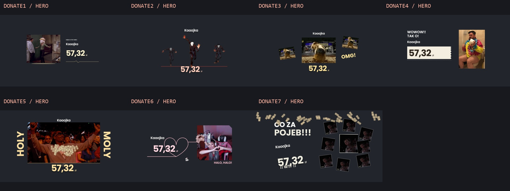
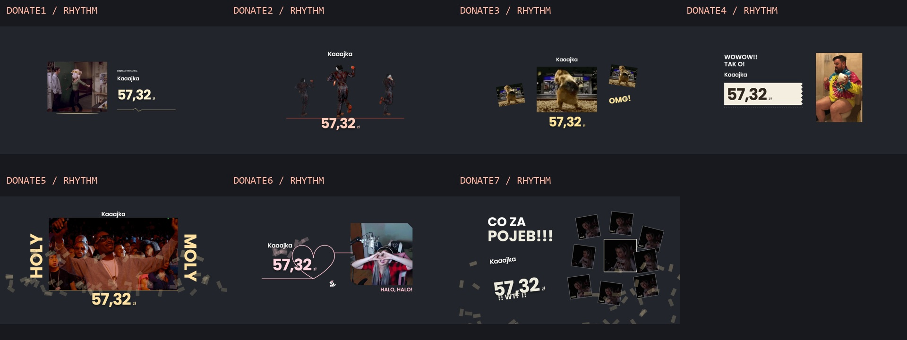

# Production v2 verification — 2026-10-07

This pass starts at `1b65044837abafb89f485329f842adc4e91525f3`. The three completed GIF-led commits were published unchanged before new work. See [baseline audit](DONATION_PRODUCTION_V2_AUDIT.md), [Music Intelligence](MUSIC_INTELLIGENCE_V2.md), [Studio operation](MOTION_STUDIO_V2.md) and [media decisions](DONATION_MEDIA_V2_AUDIT.md).

## Automated evidence

- Vitest: **293 passing tests in 31 suites**. Schema v1/v2, bounded/sorted words and timing, source-hash correction precedence, optional-analysis failure, deterministic seven-track fixtures, shared lifecycle/PLN conversion, cash determinism/caps and the existing clocks, FIFO, media and TTS contracts pass.
- Playwright: **26 passing scenarios, 1.7 minutes in the final run**. All eight previews (seven live tiers), exact-zero/backward/restart state, SAFE, failed WebM/music/TTS, media catch-up after a stall, FIFO, long-message final-line visibility, GPU loss, calibration, manual tier/data edits, all-seven extreme names, vocal correction, zoom/loop/cue navigation, actual three-stage local TTS, restart cancellation and the real UI export/download pass.
- Lint, typecheck and production build pass. Build: 162 modules, CSS 367.73 kB / 25.59 kB gzip, JS 753.61 kB / 230.17 kB gzip. The normal Vite >500 kB chunk advisory remains; the larger committed analysis fixtures account for added runtime data. Built JS is checked to exclude Studio export endpoints, test speech and inference/worker imports.
- Original GIFs, pose posters and production audio are unchanged. Six opaque WebMs passed every-frame cadence/dimension/fidelity checks with conservative CRF 4; the existing verified lossless-alpha dancer stays unchanged. Current WebMs total **41,604,844 bytes**, down from approximately 63.7 MB. See the per-source audit for PSNR, errors and decoder limits.
- Information hides the scene and releases videos. Cash is seeded and evaluated at absolute time, with total drawn caps of 72/40/14 for high/medium/SAFE; intimate Donate6 caps at 12. Cash excludes the top-tier donor/amount column. No independent animation loop or DOM bill forest is added.

Chromium tests establish local compatibility and repeatability. SwiftShader/browser timing and FFmpeg decode samples do not measure OBS plus AAA-game throughput on the requested target hardware.

## Independent visual review

A fresh reviewer examined the seven hero/contact and rhythmic compositions, late top-tier cash, information/extreme content, Studio/timeline/inspector/export and mobile fallback. **Final verdict: PASS.** All four material findings were fixed and independently confirmed:

| Finding | Confirmed resolution |
|---|---|
| Extreme nickname unreadable or still revealing at hero | Stage type stays at least 32px, wraps without truncation, total character stagger bounded; all seven tested |
| Long information header pushes message outside card | Fixed bounded flex card gives full message its own scrolling area |
| Mobile shell clips remaining editor | Scoped body/root and stacked editor scroll through the complete footer |
| Top-tier cash crosses name/amount | Deterministic exclusion keeps the donor column clear while retaining the upper storm |





Full-resolution hero PNGs, late cash, desktop/inspector/export, extreme name and information/mobile captures are committed in `docs/assets/donation-production-v2/`. The source-specific scales and normal hero footprints are documented in [brand direction](KAAAJKA_BRAND_DIRECTION.md). Contact sheets composite original transparent captures over an inspection background only.

## Deterministic export evidence

The worker uses a clean 1920×1080 stage, absolute frame time and decoder completion; development websocket is closed during capture. Local FFmpeg/ffprobe verify streams, frame count and rate. The committed [evidence JSON](assets/donation-production-v2/export-evidence.json) records request, IN/OUT, lifecycle plan, hashes and probe results.

| Render | Verified output |
|---|---|
| Donate6 selection, 3.9–4.1s, no audio | MP4/H.264, 1920×1080, 60 FPS, 12 frames, 0.2s |
| Donate1 Full Donation, custom StudioReview / 57,32 zł / Polish message | MP4/H.264 + AAC, 1920×1080, 60 FPS, 908 frames, 15.133333s; information, all three enabled local speech stages and 650ms outro |
| Donate2 selection, 3.6–3.8s, transparent/no audio | VP9 WebM, 1920×1080, 60 FPS, 12 frames, 0.2s; decoded alpha checked |
| Studio UI selection/export/download | Real local worker completes and MP4 downloads; manifest contains the normalized analysis snapshot/hash |

Repeated Donate6 first/middle/last PNG hashes match. Independent fresh Studio `renderExportAt()` captures at 3.9, 4.0 and 4.083333s **also match those PNG hashes byte-for-byte**; results are in [comparison JSON](assets/donation-production-v2/export-studio-comparison.json). First/last samples use IN and IN+(count−1)/FPS; frame-rounded duration is count/FPS, not a real-time recording duration. Full export's first information frame contains the requested nickname, formatted amount and complete message; its final sample is in the outro approaching zero opacity.

Decoded WebM alpha compared to original capture: maximum error **1/255**, mean **0.01577/255**; 94.03% fully transparent, 2.48% opaque, 3.49% intermediate. [Alpha evidence](assets/donation-production-v2/export-alpha-verification.json) verifies no opaque full-frame fill. This establishes the local FFmpeg alpha path, not every browser/OBS codec installation.

## Reproduction

```powershell
pnpm lint --diagnostic-level=error
pnpm typecheck
pnpm build
pnpm test
pnpm motion:qa
node scripts/capture-production-v2.mjs
```

Studio/CLI export examples are in its operating document. Heavy Python environment/stems and export frame sequences stay ignored. ASR candidates are unapproved; measured-energy reactions are creative timing and make no semantic lyric claim. Verified local-text forced alignment is supported but was not executed without supplied approved lyrics.

## Manual release gates

| Check | Status |
|---|---|
| Continuous listening review of musical fit, source-pose impact and meaningful lyric boundaries | Not executed here |
| OBS transparency/fidelity/VP9 support over bright and dark gameplay | Not executed here |
| Recorded click/flash calibration and real source URL sync offset | Not executed here |
| Real Tipply nickname → amount → complete message and backend replay | Not executed here |
| Sustained 60 FPS, decoder/GPU load with AAA game on Ryzen 7 7800X3D / RTX 3070 / 16 GB | Not executed here |
| OBS source hide/refresh, cancellation and return from idle | Not executed here |

Implementation and independent visual review are complete; deployment approval still requires these actual OBS/backend/target-hardware checks. Production retains the original audio clock, queue and Tipply voice behavior.
